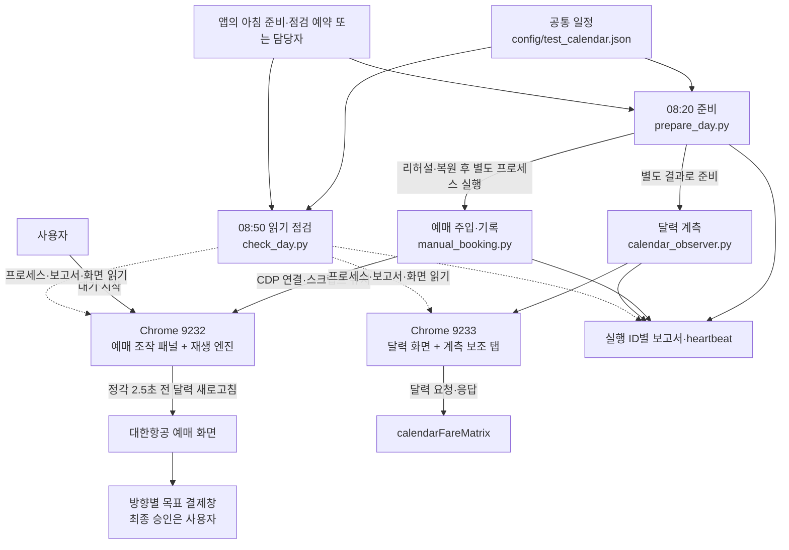

# Astra 항공권 예매·계측 도구 명세서

이 문서는 새 담당자가 도구의 목적, 구조, 실행 절차와 판정 기준을 이해하고 운영·개발을 이어가기 위한 인수인계 문서다. **요구하는 결과, 현재 코드의 동작, 실제 시험으로 확인한 범위를 구분한다.** 문서 정리 기준은 2026-09-10이며, 다음 실행의 최신 상태는 [NOW.md](NOW.md)를 먼저 확인한다.

| 문서 | 관리하는 정보 |
|---|---|
| [AGENTS.md](AGENTS.md) | AI의 작업 범위·권한·원본 보호·검증 규칙 |
| **README.md — 이 문서** | 도구의 아키텍처·동작 명세·운영·장애 진단 |
| [NOW.md](NOW.md) | 다음 목표·최신 결과·현재 문제·남은 과제 |
| [FACTS.md](FACTS.md) | 실측 근거·사이트 특성·실패에서 얻은 사실과 한계 |
| [CALENDAR.md](CALENDAR.md) | 확정 테스트 일정. 원본은 [config/test_calendar.json](config/test_calendar.json) |
| [API 개발 문서](api_booking/README.md) | 별도 고도화의 설계·구현·시험 상태 |

새 세션은 **AGENTS → NOW → README → FACTS** 순서로 읽는다. `docs/archive/`는 과거 증거 보관용이고, `CLAUDE.md`와 `BACKLOG.md`는 각각 AGENTS와 NOW를 안내한다. 과거 문서의 명령·포트를 현재 실행에 적용하지 않는다.

**새 계정·새 세션:** 같은 PC에서 `D:\Work\240_AI_project\99_side\flight_booking_astra` 폴더를 열고 [세션 인계 절차와 시작 문구](#new-session)를 따른다. 이웃 `flight_booking`은 Claude 원본이다. 문서 읽기를 준비·주문 실행 허가로 해석하지 않는다.

**목차:** [1. 목적](#purpose) · [2. 아키텍처](#architecture) · [3. 구성 요소](#components) · [4. 환경·설정](#configuration) · [5. 예매](#booking) · [6. 계측](#measurement) · [7. 운영](#operations) · [8. 장애 진단](#recovery) · [9. 검증](#validation) · [10. 변경·인계](#handoff)

<a id="purpose"></a>
## 1. 목적과 범위

대한항공 마일리지 항공권의 신규 날짜 개방 시점에 예매 절차를 빠르게 진행하고, 같은 날짜·노선의 프레스티지 표시 변화를 기록하는 도구다.

| 영역 | 입력 | 목표 결과 | 현재 범위 |
|---|---|---|---|
| 브라우저 예매 | 확정 노선·출발일·등급, 로그인, 사용자의 대기 시작 | 방향별 목표 결제창 표시 | 기존 달력 경로와 2500ms 선발사 |
| 달력 계측 | 같은 노선·출발일, 별도 로그인 세션 | 유효 표본·오류·누락·P 변화 관측 구간 | 달력 API 재조회와 실제 화면의 별도 관측 |
| API 예매 연구 | 정상 예매의 요청 구조와 시간 자료 | 좌석 확보까지 시간 단축(현재 후보 요청 전송이 대리 지표), 기능 완료는 실제 결제창 | `api_booking/`에서 별도 개발. 운영 예매의 대체물 아님 |

예매 완료 목표는 **ICN 출발은 실제 Npay, ICN 도착은 현대카드 인증수단 선택창**이다. 그 외 방향은 발생 시 사용자와 확정한다. 주문 생성은 그 전에 발생할 수 있으며 최종 결제 승인은 사용자가 한다. 결제창 도착 자체는 결제·발권 완료나 경쟁 좌석 확보를 증명하지 않는다.

계측의 P는 달력의 프레스티지 표시 조건이다. 편명별 잔여 좌석 수나 정확한 판매 완료 시각을 직접 측정하는 도구가 아니다. 현재 운영 환경은 Windows이며 주말 테스트·Mac 대응은 운영 범위 밖이다.

용어: **예매 조작 패널(HUD, Head-Up Display)**은 브라우저에 겹쳐 표시되는 목표·등급·시간·대기 시작 패널이다. **대기 설정(코드의 armed)**은 정시 실행을 예약한 상태, **발사**는 그 시각에 예매 흐름을 시작한 동작이다. **heartbeat**는 작업자가 주기적으로 남기는 생존 기록이다.
**CDP(Chrome DevTools Protocol)**는 Python 작업자가 실행 중인 전용 Chrome에 연결하는 통로이며, **DOM**은 브라우저가 현재 표시하는 화면의 문서 구조다.

<a id="architecture"></a>
## 2. 전체 아키텍처



### 2.1 실행 주체와 수명

- `prepare_day.py`는 예매 준비를 먼저 수행하고 계측 준비를 이어서 수행한다. 정상 당일 모드에서는 두 작업자를 각각 별도 프로세스로 시작하므로, **준비 프로그램의 정상 종료가 두 작업자의 종료를 뜻하지 않는다.**
- **정시 예매를 시작하는 주체는 브라우저의 예매 조작 패널**이다. 정상 운영의 `manual_booking.py`는 대기를 설정하지 않는다. 사용자가 대기 시작을 누른 후 패널이 보정 시각에 실행한다. `--rehearsal`에서만 프로그램이 시험용 대기 버튼을 클릭한다.
- `manual_booking.py`는 브라우저 연결을 유지하면서 페이지가 새로 열릴 때 스크립트를 주입하고 실행·네트워크·결제창을 기록한다. 재생 상태는 브라우저 저장소에 남겨 새로고침 후 이어간다. **대기 중 이 작업자를 종료하면 주입·기록의 연속성이 깨질 수 있다.**
- 계측의 요청 타이머는 9233의 보조 탭에서 실행된다. Python 작업자가 표본과 화면 상태를 회수해 저장한다. 정상 종료 시 계측을 멈추고 해당 보조 탭을 닫는다. 보조 탭만 남았다고 정상 기록 중인 것은 아니다.
- Chrome 이름표 유지 프로그램은 표시만 담당한다. 창 제목의 포트·역할 표시를 예매 또는 계측의 실행 상태로 해석하지 않는다.

### 2.2 분리되는 것과 공유하는 것

예매는 9232·`.debug-profile`, 계측은 9233·`.debug-profile2`를 사용한다. 프로세스·브라우저 프로필·로그인 세션·실행 ID·준비 결과가 분리된다. 예매 준비가 실패해도 계측 준비를 시도하고, **계측 실패를 이유로 예매 작업자를 종료하지 않는다.**

두 영역은 같은 PC·네트워크·공통 일정과 준비 마감 예산을 공유한다. 완전한 성능 격리는 아니다. 화면 새로고침이 계측 타이머를 지연시킨 리허설 결과 때문에 운영 계측 중에는 달력 화면을 반복 새로고침하지 않는다.

API 연구는 9242·`.api-profile`과 `api_booking/`를 사용한다. 운영 프로필을 복사하거나 연구 코드를 운영 예매에 자동으로 적용하지 않는다.

<a id="components"></a>
## 3. 구성 요소와 책임

| 구성 요소 | 책임과 수정 지점 |
|---|---|
| [dev/test_calendar.py](dev/test_calendar.py) | 일정 해석, 실행일→출발일 계산, 리허설 날짜 선택, CALENDAR 생성 |
| [dev/prepare_day.py](dev/prepare_day.py) | 준비 단계 실행, 시간 제한·실패 단계 기록, 두 작업자 시작과 준비 판정 |
| [dev/astra_browsers.ps1](dev/astra_browsers.ps1) | 소유권을 확인한 전용 Chrome 실행·선택적 재시작, 동일 실행 플래그 적용 |
| [dev/browser_identity.py](dev/browser_identity.py) | 프로필명·창 제목·화면 이름표와 새로고침 후 표시 유지 |
| [dev/setup.py](dev/setup.py) / [dev/prepare_currency.py](dev/prepare_currency.py) | 로그인·편도 마일리지·노선·날짜 구성, 조회 화면의 KRW 적용 확인 |
| [dev/manual_booking.py](dev/manual_booking.py) | 확정 목표 주입, 대기 미설정 초기화, 스크립트 유지, 실제 실행·결제창 기록 |
| [ke_award/hud.js](ke_award/hud.js) | 조작 패널·사용자 대기·시계 보정·정시 시작 |
| [ke_award/recorder.js](ke_award/recorder.js) / [ke_award/util.js](ke_award/util.js) | 단계 재생·페이지 전환 대기·동적 날짜와 좌석 탐색·재시도 |
| [ke_award/steps.json](ke_award/steps.json) | 예매 17단계 원본. 과거 녹화 설명보다 현재 목표 설정과 실행 코드가 우선 |
| [build.mjs](build.mjs) | JS 모듈과 단계를 [실행용 userscript](userscript/ke-award-macro.user.js)로 묶음. 산출물만 직접 고치지 않음 |
| [dev/calendar_observer.py](dev/calendar_observer.py) / [ke_award/calendar_probe.js](ke_award/calendar_probe.js) | 실제 달력 요청 포착·반복 요청·P 판정·시간 및 누락 기록·화면 대조 |
| [dev/check_day.py](dev/check_day.py) / [dev/worker_health.py](dev/worker_health.py) | 당일 실행 선택, 작업자 생존·heartbeat·목표·실제 패널 읽기 점검 |
| [dev/session_health.py](dev/session_health.py) | 토큰 원문을 출력하지 않고 로그인 만료와 정각 이후 유지 여부 진단 |
| [dev/payment_window.py](dev/payment_window.py) / [dev/network_trace.py](dev/network_trace.py) | 결제창 읽기 판정, 요청·응답 시간과 제한된 결과 기록 |
| [dev/runtime.py](dev/runtime.py) | 실행 ID, 원자적 JSON 저장, 해시, 시계 측정, heartbeat |

현재 운영 진입점은 `prepare_day.py`와 `check_day.py`다. 이전 `daily.py`·`autorun.py`·`watch_seats.py`의 실행법은 현재 절차에 섞지 않는다. `dev/astra_target.ps1`은 준비 프로그램으로 연결하는 호환 진입점이다.

<a id="configuration"></a>
## 4. 실행 환경·설정·일정

### 4.1 환경과 최초 설치

작업 폴더는 `D:\Work\240_AI_project\99_side\flight_booking_astra`다. 현재 가상환경 메타데이터는 Python 3.13.7이며, 의존성은 [requirements.lock.txt](requirements.lock.txt)에 고정되어 있다. Node.js는 userscript 빌드에 필요하다. Chrome 실행기는 현재 `C:\Program Files\Google\Chrome\Application\chrome.exe`를 사용한다.

기존 환경을 매일 다시 설치하지 않는다. **새 PC에 처음 구성할 때** 사용하는 명령 예시는 다음과 같다. 새 환경은 설치 후 별도 리허설이 필요하다.

```powershell
Set-Location 'D:\Work\240_AI_project\99_side\flight_booking_astra'
py -3.13 -m venv .venv
.\.venv\Scripts\python.exe -m pip install -r requirements.lock.txt
.\.venv\Scripts\python.exe -m playwright install chromium
node build.mjs
```

운영 Chrome은 위 설치 Chrome이고, Playwright의 Chromium은 로컬 브라우저 시험에도 사용된다. 전용 실행기는 팝업 허용·배경 타이머 제한 완화·창 크기 설정을 함께 적용한다. 일반 Chrome 실행이나 Chrome 재시작만으로 PC 부팅 시험을 대체하지 않는다.

예매 계정 설정은 로컬 `.env`의 `KE_SKYPASS_ID`·`KE_SKYPASS_PW`·선택적 `KE_LOGIN_TAB`을 사용한다. 실제 값은 문서·로그에 쓰지 않는다. [.env.example](.env.example)은 키 형식 참고용이며 일부 옛 포트 주석보다 현재 명세의 9232/9233이 우선한다. 9232 자격정보 누락을 다른 계정 로그인으로 대체하지 않는다. 9233은 네이버 연동 세션을 사용하며 추가 인증이 필요하면 사용자 조치 후 다시 점검한다.

| 구분 | 포트 / 프로필 | 사용자에게 보이는 표시 |
|---|---|---|
| 운영 예매 | 9232 / `.debug-profile` | `ASTRA · 9232 · 예매`, 보라색 |
| 운영 계측 | 9233 / `.debug-profile2` | `ASTRA · 9233 · 계측`, 초록색 |
| 별도 API 연구 | 9242 / `.api-profile` | 연구 영역. 구현·실행 상태는 API 개발 문서에서 확인 |

### 4.2 설정의 원본과 적용 방식

| 설정 | 현재 값 / 적용 방식 |
|---|---|
| 시간대·준비·개방 | Asia/Seoul, 08:20 준비, 09:00 개방 |
| 실행일 / 출발일 | `--day`는 테스트 실행일. 실전 출발일은 실행일 + 360일 |
| 노선·등급 | 공통 일정의 해당 구간 노선, 프레스티지. 리허설은 같은 방향의 일반석 |
| 선발사 | 2500ms. 09:00 기준 08:59:57.500에 예매 시작 |
| 계측 | 요청 간격 1000ms, 동시 요청 최대 2, 슬롯 대기 최대 150ms, 측정 중 화면 새로고침 0 |
| 운영 범위 | 확정 기간의 평일 중 출발일 일요일 제외. 주말·제외일·범위 밖은 실행하지 않음 |

일정 원본을 `test_calendar.py`가 해석하고 준비·예매·계측이 같은 계획을 읽는다. 예매·계측은 시작 시 목표를 읽으므로 실행 중 파일을 바꿨다고 이미 대기 중인 작업자에 반영된 것으로 보지 않는다.

리허설은 다음 실행일의 **노선 방향**을 사용하되, 출발일은 현재 이미 열린 날짜를 선택한다. 현재 계산은 09시 전에는 오늘 + 359일, 이후에는 오늘 + 360일을 상한으로 하며, 출발일 제외 요일이면 이전 허용일까지 거슬러 선택한다. 실제 운항·좌석은 사이트에서 확인해야 한다.

일정 확인: `.\.venv\Scripts\python.exe dev\test_calendar.py --day 2026-09-11`. 일정 변경을 확정한 후에만 `--render`로 CALENDAR를 재생성한다. 매일의 구체 날짜는 이 문서에 복제하지 않고 [확정 일정](CALENDAR.md)에서 확인한다.

### 4.3 시계·로그인 기준

`runtime.py`는 NTP 오프셋·왕복 기반 불확실성을 측정한다. 예매 작업자는 성공한 측정값을 패널에 적용하고 발사 전 15분 간격으로 다시 측정한다. 계측은 시작 시 측정값으로 요청 시작 시각을 계산한다. NTP 실패 시 코드가 로컬 시각으로 계속할 수 있으므로 `clock.ok=false`를 시각 동기화 성공으로 보고하지 않는다.

예매 로그인 판정은 토큰 만료가 개방 시각 + 180초 이상인지 본다. 토큰이 없거나 구조를 해석하지 못하면 ‘미확인’이다. 이 검사는 향후 서버 세션 유지를 보장하지 않으며 계측 인증까지 검증하는 기준도 아니다.

<a id="booking"></a>
## 5. 예매 동작 명세

### 5.1 준비와 사용자 대기

준비는 **이미 열린 날짜의 조회 화면에서 KRW를 확인하는 것부터** 시작한다. USD이면 KRW 선택 → 적용 → 실제 KRW 표시를 기다린다. 적용으로 달력에 돌아오면 같은 리허설 날짜로 재조회한다. 그 뒤 일반석 결제창 리허설을 수행한다.

달력 노선은 해당 응답을 만든 실제 POST 요청의 `segmentList`로 검증한다. 응답에 공항 필드가 없는 경우에도 검증된 편도 요청과 단일 달력 응답을 대응시키며, 응답에 공항 필드가 있으면 그 값도 대조한다. 다른 노선·다중 여정·HTTP/본문 오류·잘못된 응답 구조는 중단하고, 검증 근거만 `manual_booking.json`의 `routeEvidence`에 남긴다.

리허설 후 실제 목표 날짜·프레스티지·달력 시작·2500ms를 패널에 설정한다. 목표 날짜가 아직 미개방인 것은 정상이며, 이 단계의 준비 성공이 목표 좌석 존재를 뜻하지 않는다. 대기는 해제된 상태로 사용자에게 인계한다.

| 상태 | 의미와 다음 동작 |
|---|---|
| 미리보기 | 전날 `--preview` 결과. 목표 표시만 하고 대기 버튼은 비활성. 당일 준비 필요 |
| `ready-unarmed` | 주입·기록 작업자가 준비됨. 사용자가 목표를 확인하고 대기 시작 |
| `armed-by-user` | 사용자가 대기를 설정함. 패널이 예약 시각을 기다림 |
| `running` | 발사를 관측한 뒤 예매 진행·결제창을 추적 중 |
| 실제 결제창 / 실패 / 마감 | 도착 증거 또는 실패 이유를 저장. ‘작업자 종료’만으로 성공 판정하지 않음 |

**`prepare_day.py`나 `manual_booking.py`를 다시 시작하면 예매 대기와 재생 상태를 초기화한다.** 이미 대기한 뒤 상태만 보고 싶을 때는 `check_day.py`를 사용한다.

### 5.2 정시 실행과 17단계

아래 단계 번호는 현재 `steps.json`의 사람 기준 1~17번이다. 로그의 `idx`는 코드상 진행 인덱스이므로 화면·총 단계와 함께 읽는다.

| 단계 | 동작 | 완료 조건과 실패 처리 |
|---|---|---|
| 발사 | 패널이 개방 2500ms 전 달력 새로고침 | 로딩 완료 후 목표 날짜 접근성을 검사. 미접근이면 달력 재조회, 접근 가능하면 진행 |
| 1~2 | 목표 날짜 선택 → 검색 | 확정 목표 날짜를 선택하고 항공편 조회 화면 진입. 과거 녹화 날짜·셀 순서만으로 결정하지 않음 |
| 3~5 | 목표 등급 선택 → KRW 확인 → 다음 | 좌석 선택과 양수 마일리지 총액 확인. KRW 변경으로 선택이 풀리면 날짜 선택부터 다시 진행 |
| 6~7 | 승객 정보 확인 → 연락처 확인 | 해당 화면의 확인 절차 진행. 연락처 확인 단계는 실행 시 `noRetry`를 적용해 중복 클릭 재시도 제한 |
| 8~10 | 첫 동의 → 끝까지 스크롤 → 확인 | 첫 모달의 동의 절차 완료. 클릭 기록만으로 다음 모달까지 끝났다고 보지 않음 |
| 11~13 | 위험품 등 두 번째 동의 → 스크롤 → 확인 | 두 번째 모달도 별도 완료 |
| 14 | 마일리지 적용 | 적용 절차 진행 |
| 15~16 | 방향별 결제수단 선택 | ICN 출발은 Npay, ICN 도착은 한국발행 신용/체크카드 → 현대카드. manual_booking 설정에서 원본 단계를 방향에 맞게 구성하며 다른 수단으로 자동 대체하지 않음 |
| 17 | 대한항공의 ‘결제하기’ 클릭 | 새 결제 제공자 창을 열고 실제 도착 화면을 별도로 판정 |

조회 화면을 새로고침 없이 API 데이터만 바꿔 진행하는 실험 경로는 운영 예매에 사용하지 않는다. Python이 패널의 정시 실행을 대신하는 별도 발사 경로도 운영에 두지 않는다.

### 5.3 실제 결제창과 종료 판정

현재 `manual_booking.py`는 확정 일정의 방향으로 결제 정책을 정한다. 작업자 시작 전에 이미 열린 창은 새 실행의 도착 증거에서 제외한다. 로그인·오류·목표와 다른 제공자는 성공이 아니다.

| 방향 | `ready=true` 조건 | 해석 한계 |
|---|---|---|
| ICN 출발 | `pay.naver.com` 또는 `m.pay.naver.com`의 새 창. 로딩 완료·대한항공 가맹점·금액·보이는 결제 버튼 확인 | 최종 결제 승인·발권 완료 아님 |
| ICN 도착 | `ansimclick.hyundaicard.com/xacs3/`의 새 창. 로딩 완료·보이는 앱카드 결제/PIN번호 결제 선택·오류/로그인 없음 | 인증수단 선택 단계까지. 금액 검증은 false이며 최종 인증·결제는 사용자 |
| 그 외 | 결제 정책 미확정 | 사용자와 기준 확정 후 진행 |

`payment_window.py`의 기본 정책은 기존 호출자를 위해 Npay지만, 운영 예매와 리허설 정리는 방향별 정책을 명시적으로 전달한다. `manual_booking.json`의 `paymentProvider`, `completionCriterion`, `configuration.paymentProvider`, `paymentWindow.provider/stage`를 대조한다. 다른 팝업이 의미 있는 결제 진단을 덮지 않는다.

방향별 정책·선택 설정·창 판정은 로컬 시험 대상이다. 기존 Npay 리허설 및 FCO→ICN 현대카드 관측을 이번 변경 후 실사이트 시험으로 소급하지 않는다. CDG→ICN 전체 재시험은 방향 전환 리허설에서 수행한다.

일반적인 실행 상한은 개방 시각 + 240초다. 매크로가 멈추면 문제 상태 또는 결제창 미도달 대기를 확인해 실패를 기록한다. 정상 종료 시 진행한 재생을 멈추고 대기를 해제한다. 예외 종료에서는 브라우저에 남은 상태를 별도로 점검해야 한다.

리허설도 주문을 만들 수 있다. 시험 결제창을 닫고 초기 화면으로 돌아간 것만으로 서버 주문 취소·좌석 해제까지 완료됐다고 판단하지 않는다. 예매 보고서의 `seatRelease.verified`, 준비 보고서의 `rehearsalCleanup.serverSeatReleaseVerified`는 해제 증거가 없으면 false로 남긴다.

<a id="measurement"></a>
## 6. 계측 동작 명세

### 6.1 요청과 화면의 관계

1. 9233에서 실제 달력 POST `/api/ap/booking/avail/calendarFareMatrix`를 포착한다.
2. 같은 세션의 요청 구조를 메모리에서 사용하고, 노선을 확인한 뒤 출발일을 목표 `YYYYMMDD` 전체 값으로 적용한다.
3. 동일 사이트 출처의 전용 보조 탭에서 정각부터 요청한다. 조회·좌석 선택·주문 화면으로 이동하지 않는다.
4. Python이 표본·요청 시각·응답 시각·오류·화면 상태를 회수해 저장한다.
5. 측정 중 달력 DOM은 새 서버 응답으로 자동 갱신된다고 가정하지 않는다. 초록색 상태표에 서버 결과를 따로 표시한다.
6. 종료 후 실제 달력을 새로고침하고 `postMeasurementUi`의 새 응답과 화면 P 표시를 대조한다.

### 6.2 P 판정과 표본 상태

응답의 `boundFareCalendarList[].fareCalendarList[]`에서 **노선과 목표 날짜가 정확히 일치하는 항목**을 찾는다. 정상 운임 구조에서 `fareFamilyList`의 `KEBONUSPR`과 같은 인덱스의 `fareFamilyStatus != SOLDOUT`일 때 P가 있다고 판정한다. 날짜의 운임이 명시적으로 비어 있는 `emptyFare` 분기도 처리한다.

| 결과 | 의미 | 매진으로 해석 가능한가 |
|---|---|---|
| `valid, p=true` | 응답상 P 표시 조건 충족 | P 존재 관측 |
| `valid, p=false` | 해당 유효 날짜에서 P 조건 미충족 | 이전 존재 표본 없이 소멸 시각을 추정하지 않음 |
| `date-not-listed` | 응답에 목표 날짜가 없음 | 미개방 등의 가능성. P 없음과 구분 |
| `application-error` / `http-error` | HTTP 또는 응답 본문의 오류 | 유효한 좌석 표본 아님 |
| `schema-error` / `route-mismatch` / `ambiguous-date` | 구조·노선·날짜를 확정할 수 없음 | 판정 불가 |
| 요청·JSON 오류 / 화면 로딩·날짜 미표시 | 수신 또는 화면 관측 실패 | 판정 불가 |

화면(DOM) 판독은 보이는 날짜 셀의 P와 비활성 상태를 별도로 읽는다. DOM 판독은 월·일 표시를 사용하므로 연도·노선까지 화면 판독 하나로 검증한 것으로 보지 않는다. 실제 목표와 API 데이터의 일치 확인이 함께 필요하다.

### 6.3 시간·동시 요청·종료

| 항목 | 현재 기본 동작 |
|---|---|
| 요청 간격 | 1000ms. 응답 수신 간격 1초를 보장하는 값이 아님 |
| 동시 요청 | 최대 2개. 가득 차면 최대 150ms 대기 후에도 여유가 없을 때 누락 기록 |
| 개별 요청 제한 | 6초 후 중단 요청 |
| 서버 제한 처리 | HTTP 429 또는 본문 코드 503이면 2초 대기. HTTP 401/403이면 이후 요청 예약 중단 |
| 타이머 지연 | 늦게 실행된 슬롯·건너뛴 슬롯을 기록. 밀린 요청을 한꺼번에 보충하지 않음 |
| 수집 창 | 기본 90초. 진행 중 응답을 추가 회수한 후 실제 화면 대조 |
| 비교 실험 | 0.5초·동시 4개·Web Worker는 운영 기본값에 포함하지 않음 |

정상 종료의 `ok=true`는 **유효 표본이 한 건 이상 있었다는 뜻**이다. 누락 없는 계측이나 P 소멸 관측을 의미하지 않는다. `validSamples`, `errors`, `skippedRequests`, `missedTimerSlots`, 첫 응답과 응답 간격을 함께 읽는다.

P 있음→없음 전이는 요청 순서와 양쪽 표본의 송신·수신 시각으로 관측 구간을 제시한다. 요청이 겹치거나 응답 순서가 뒤집힌 경우도 표시한다. 처음부터 P가 없으면 ‘첫 유효 표본부터 없음’이라고 보고한다. 캐시·왕복·판독 지연을 포함하므로 정확한 판매 완료 시각으로 단정하지 않는다.

<a id="operations"></a>
## 7. 운영 절차와 역할

| 시점 | 준비 담당자 / 프로그램 | 사용자 |
|---|---|---|
| 전날 필요 시 | 다음 실행일의 방향으로 사전 리허설, 이미 열린 일반석 결제창 도착 후 목표 미리보기 복원 | 필요한 로그인·인증 처리 |
| 당일 08시 부팅 이후 | PC·앱·전용 Chrome 연결 환경 확인 | 평소처럼 PC 부팅·업무 시작 |
| 08:20 | Chrome·로그인 → 해당 방향 KRW → 일반석 실제 결제창 → 시험 창 정리 → 실전 목표 복원 → 두 작업자 준비 결과 알림 | 목표·등급·시각 확인 후 예매 패널의 대기 시작 |
| 08:50 | 같은 실행의 프로세스·로그인·패널·계측 보조 탭을 읽기 점검. 문제 있을 때 알림 | 필요 조치 후 대기 상태 확인 |
| 08:59:57.500 / 09:00 | 예매 패널이 선발사 / 계측기가 정각부터 요청 | 실행 상태 확인 |
| 09시 이후 | 각 실행 결과·실패 단계·계측 관측 범위 보고 | 원하는 실제 결제창에서 최종 승인 |

앱 예약 `항공권 아침 준비·점검`이 08:20·08:50 담당 작업을 깨우는 구조다. 예약은 PC·앱의 실행 가능 상태에 의존하며 저장소 명령만으로 PC 부팅을 보장하지 않는다. 예약 상태 변경은 별도 관리 대상이다. 원본의 `ke_morning`·`ke_precheck`는 사용자 승인으로 사용 중지한 상태이며 다시 켜지 않는다.

### 7.1 표준 실행 명령

아래 `2026-09-11`은 **실행일 예시**다. 매번 CALENDAR의 실제 실행일을 넣는다. 명령은 Astra 작업 폴더에서 실행한다.

```powershell
# 당일 08:20 준비
.\.venv\Scripts\python.exe dev\prepare_day.py --day 2026-09-11

# 전날 추가 리허설: 전용 Chrome 재시작 포함
.\.venv\Scripts\python.exe dev\prepare_day.py --day 2026-09-11 --preview --cold

# 08:50 상태 점검: 새로고침·대기 변경·프로세스 종료 없음
.\.venv\Scripts\python.exe dev\check_day.py --day 2026-09-11
```

`--cold`는 전용 Chrome 재시작이며 OS 재부팅이 아니다. `--preview`는 예매를 실제 결제창까지 시험하는 모드이므로 주문 없는 모의 실행으로 해석하지 않는다. 종료 후 미리보기의 대기 버튼은 비활성화된다.

당일 준비는 실행일이 오늘인지 검사하고 08:50 이후 새 준비를 거부한다. 주말·출발일 제외 요일은 건너뛰고, 확정 범위 밖은 오류로 처리한다. 지나간 시각을 다음 날 주문으로 자동 이월하지 않는다. 전날 추가 시험은 노선 전환·중요 목표 점검일·실패 또는 코드 변경 때 시행하며 구체 일정은 CALENDAR를 따른다.

### 7.2 준비·점검 결과 읽기

`prepare_day.json`의 `booking.ready`와 `observer.ready`는 각각 읽는다. 준비 명령의 종료 코드 0은 예매 준비 성공 또는 주말 건너뛰기일 수 있으며, **계측까지 성공했다는 의미는 아니다.**

`check_day.py`는 해당 실행일의 가장 최근 **당일 준비 기록**을 선택한다. 미리보기는 제외한다. 실행 ID·살아 있는 작업자·5초 미만 heartbeat·목표·준비 상태를 대조하고, 예매는 로그인 만료·실제 패널, 계측은 같은 실행의 보조 탭을 읽는다.

점검 결과의 `booking.ready`는 준비 상태, `booking.readyForOpening`은 여기에 사용자 대기까지 확인된 상태다. 계측 오류는 예매 점검 종료 코드와 독립이다. 실패 종료 코드는 조치 필요 표시이며 어떤 작업자도 종료하지 않는다.

<a id="recovery"></a>
## 8. 장애 진단·로그·복구

### 8.1 실행 추적

보고서 위치는 `dev-shots/runs/<실행 ID>/`다. 준비·예매·계측은 서로 다른 실행 ID를 가질 수 있다. **부모 prepare_day.json의 service.runId 또는 단계 로그에서 자식 실행 ID를 찾고** 그 폴더를 읽는다. 단순히 가장 최근 수정된 JSON을 오늘 실전 결과로 선택하지 않는다.

| 자료 | 확인할 내용 |
|---|---|
| `prepare_day.json` | 두 영역의 ready, 현재/실패 단계, 단계별 시작·종료·소요·제한·PID·로그 경로 |
| `manual_booking.json` | 계획·실제 설정·노선 확인·로그인 진단·해시·발사 시각·진행 사건·실제 결제창 |
| `network.json` | API 요청·응답 시각·오류·제한된 업무 필드. HTTP 200만으로 주문 수락 단정 금지 |
| `browser_timing.json` / `ui-timing/browser_timing.json` | 예매 또는 계측 보조 탭의 CDP 요청 시작·종료·호출 스크립트 위치, 긴 작업·타이머 지연·가시성. 계측 종료 후 달력은 ui-timing에 별도 기록. URL 쿼리·요청 본문·헤더 미수집 |
| `calendar_observer.json` | 원시 사건·표본 집계·요청 간격·오류·P 전이·화면 대조·시계 정보 |
| `manual-booking_status.json` / `calendar-observer_status.json` | 실제 작업자 PID·실행 ID·목표·상태·최근 heartbeat |
| `dev-shots/checks/<시각>.json` | 08:50 읽기 점검에서 관측한 두 영역의 상태와 문제 |

Python 가상환경 실행기의 PID와 실제 작업자 PID가 다를 수 있다. PID 또는 파일 존재 하나만으로 생존을 판정하지 않는다. JSON은 임시 파일 작성 후 교체하는 방식으로 저장한다. 보고서에는 재현에 필요한 설정·해시를 남기되 자격정보와 요청 본문 원문은 남기지 않는다.

### 8.2 증상별 판단과 다음 조치

주문 없는 달력 지연 진단은 `python dev/diagnose_calendar.py --port 9233 --reload --seconds 35`로 수행한다. 달력 탭이 정확히 하나이고 대기·재생이 꺼진 경우에만 새로고침한다. 요청 시작 전 지연과 API 왕복을 구분하며, 로컬 회귀 시험 등 병행 부하를 기록한다. 계측의 `maxStartDelayMs=150`은 동시 요청 슬롯 대기 한도다. 타이머 실행을 보장하지 않으며, 한 주기 이상 지난 슬롯은 `stale-slot`, 측정 종료 후 슬롯은 `measurement-ended`로 건너뛴다. `request-timeout`의 예정/실행 시각으로 6초 abort 타이머 자체의 지연을 확인한다.

| 증상 | 우선 확인할 증거 | 복구 원칙 |
|---|---|---|
| 창은 있지만 준비 안 됨 | 현재 실행의 service·heartbeat·패널 상태 | 이름표는 상태 증거가 아님. 작업자 상태부터 확인 |
| 로그인 만료·홈 복귀 | 실패 단계, session의 known/coversOpen, 실제 로그인 요구 | 준비 시간에 해당 프로필 로그인 복구. 무장 후 준비 프로그램 전체 재실행은 대기를 초기화하므로 피함 |
| 날짜·방향이 다름 | 공통 일정, report.plan·target·실제 패널·routeVerified | 실행일과 여행일 혼동부터 확인. 다른 목표로 즉석 진행하지 않음 |
| USD가 유지됨 | currency.before·changed·verified, 실제 조회 화면 | KRW 선택뿐 아니라 적용·재표시 확인. 다른 방향의 유지 여부를 전용 리허설로 검사 |
| 날짜 접근 불가 | 달력 로딩·목표 셀, 개방 전후 시각 | 로딩·미개방·접근 불가를 구분. 계측 P 존재가 클릭 가능성을 보장하지 않음 |
| 17단계 뒤 목표 결제창 없음 | paymentWindow.provider/stage, 로그인·오류·새 창 여부 | 실제 제공자 화면까지 확인. 방향별 목표 제공자와 실제 stage를 대조 |
| 계측 첫 표본부터 P 없음 | firstValidSinceOpen·initiallyAbsent·앞선 오류/누락 | ‘그 전에 몇 초 만에 매진’이라고 단정하지 않음 |
| 계측 응답 간 공백 | sent·queued·skipped·timer-gap·응답 지연·network timing | 발송 지연과 수신 지연을 나눔. 화면 새로고침이나 간격 단축으로 임의 보충하지 않음 |
| 준비 시간 초과 | failedStage, 단계 timeoutSeconds·elapsedSeconds·timeoutCleanup | 해당 단계의 프로세스 트리 정리 결과 확인. 정상 대기 중인 별도 예매 작업자는 종료하지 않음 |
| 프로그램이 갑자기 종료 | 마지막 heartbeat·종료 코드·why·단계 로그, 브라우저 잔여 상태 | 종료를 성공으로 보지 않음. 원인 기록 후 중복 실행 가능성부터 확인 |

공통 준비 마감과 하위 명령별 제한이 적용되지만, 직접 브라우저 호출에는 자체 제한도 있다. 08:50 순간 모든 코드가 동시에 종료된다는 의미는 아니다. 이미 시작한 예매를 계측 문제나 읽기 점검 실패 때문에 중단하지 않는다.

**알려진 판정 한계:** 기존 `network.json`의 `orderCreated`는 과거 실행기 호환용 필드 관측값이다. false를 주문 실패나 좌석 미확보의 단독 증거로 사용하지 않는다. 새 `orderEvidence`는 허용한 응답 필드의 구조·HTTP 상태·식별자 관측 여부를 기록한다. 업무 수락 구조가 입증되기 전에는 `acceptance=unverified`, `seatHoldVerified=false`다. 본문 값·회원 정보·주문 식별자 원문은 저장하지 않는다.

<a id="validation"></a>
## 9. 검증·완료 기준

| 구분 | 통과가 의미하는 것 | 의미하지 않는 것 |
|---|---|---|
| T1 로컬 시험 | 픽스처·파서·타이머·프로세스 제어가 시험 조건에서 동작 | 실사이트·신규 개방 성공 |
| T2 실사이트 리허설 | 명시한 노선·날짜·등급·환경에서 실제 도착/계측 | 09시 신규 프레스티지 경쟁 성공 |
| T3 실조건 관측 | 확정 일정의 실제 09시 신규 개방을 같은 실행 로그로 확인 | 한 번의 성공으로 이후 매일 성공 보장 |

검증 지침은 [ke-verify](.claude/skills/ke-verify/SKILL.md)를 따른다. 09시 실조건은 연속 2회 통과 전까지 `1/2`처럼 횟수를 명시한다. 신규 개방에 의존하는 코드는 미개방 → P 있음 → P 없음 전이 픽스처를 먼저 통과해야 한다.

예매 리허설 완료는 목표 방향·일반석·KRW·정상 대기 경로·방향별 목표 결제창·최종 승인 없음까지 확인한 범위로 보고한다. 계측 완료는 유효 표본 수뿐 아니라 첫 응답·간격·오류·누락·P 전이 여부를 함께 보고한다. `ok`나 총 단계 수 한 개로 전체 요구사항 통과를 대신하지 않는다.

### 9.1 증거의 원본

최신 결과·잔여 문제는 [NOW](NOW.md), 날짜와 실행 ID가 붙은 성공/실패 근거는 [FACTS](FACTS.md)에만 관리한다. 과거 시험의 통과를 현재 코드·현재 세션의 준비 완료로 소급하지 않는다. 증거가 없는 새 복제본에서는 필요한 로컬 자료를 확인하기 전 성공 주장을 이어 쓰지 않는다.

<a id="handoff"></a>
## 10. 변경·인수인계 지침

### 10.1 변경 위치와 필요한 시험

| 변경 내용 | 확인할 파일 / 시험 |
|---|---|
| 일정·노선·날짜 계산 | 공통 JSON·test_calendar.py·CALENDAR 생성본, 날짜·주말·전환 규칙 시험 |
| 준비·마감·작업자 판정 | prepare_day.py·worker_health.py·check_day.py, `test/test_day_readiness.py` |
| 날짜·선발사·재생·동의·통화 | hud.js·recorder.js·util.js·steps.json, 빌드 후 핵심 8개와 관련 시험 |
| 결제창 판정 | payment_window.py, `test/test_payment_window.py`와 실제 제공자 도착 리허설 |
| 계측 구조·간격·P 판정 | calendar_observer.py·calendar_probe.js, `test/test_calendar_observer.py`·`test/test_calendar_probe.js`와 간격 비교 |
| API 고도화 | api_booking/ 내부에서 독립 시험. 운영 예매·계측에 자동 적용하지 않음 |

핵심 회귀는 `hud`, `parity`, `skipcal`, `calendar`, `deadclick`, `twoagree`, `pagewait`, `currency`다. 주요 실행 변경 시 아래처럼 개별 시험을 수행하고 종료 코드·로그를 남긴다.

```powershell
node build.mjs
if ($LASTEXITCODE -ne 0) { throw 'userscript 빌드 실패' }
$checks = 'hud','parity','skipcal','calendar','deadclick','twoagree','pagewait','currency'
foreach ($name in $checks) {
    & .\.venv\Scripts\python.exe "test/test_$name.py"
    if ($LASTEXITCODE -ne 0) { throw "회귀 실패: $name" }
}
# 준비 판정 변경 시 추가
.\.venv\Scripts\python.exe test/test_day_readiness.py
```

기존 `t.sh`에는 headless Chrome을 프로세스 이름으로 일괄 종료하는 정리 코드가 있어, 다른 작업과 병행하는 환경에서는 위 개별 실행 방식을 사용한다. 단순 문서 변경은 명령·링크·코드 대조로 확인하며 실사이트 주문을 새로 만들 필요가 없다.

<a id="new-session"></a>
### 10.2 새 세션 시작 절차

대화 이력 없이 **현재 로컬 작업 내용과 증거**를 읽고 이어간다. 시작점은 같은 PC의 `D:\Work\240_AI_project\99_side\flight_booking_astra`다. 이웃 `flight_booking`은 Claude 원본이다. 새 세션을 여는 데 새 폴더·Git 복제·worktree가 필요하지 않다. 문서 검토만 요청받았다면 인수인계 확인까지 수행하고, 이어서 개발을 요청받았다면 아래 확인 후 해당 작업을 계속한다.

| 순서 | 할 일 | 확인 결과 |
|---|---|---|
| 1. 원본 읽기 | AGENTS → NOW → 이 README → FACTS. CALENDAR와 공통 JSON 대조; API 작업이면 API 문서도 읽음 | 작업 영역·현재 과제·완료 기준 이해. 과거 대화의 FCO/9월4일 목표를 현재 일정에 덮어쓰지 않음 |
| 2. 날짜·일정 | 한국 시각과 NOW 기준일 비교, 일정 코드로 실제 실행일/출발일/방향/리허설 날짜 확인 | 실행일과 여행일 구분. ‘내일’·명령 예시 날짜 재사용 금지. 휴무·확정 범위 밖이면 자동 이월하지 않음 |
| 3. 로컬 상태 | `git status --short`, 필요한 코드·가상환경·빌드·근거 파일 존재 확인 | 미커밋·미추적 파일을 현재 작업의 일부로 보존. reset/clean/재설치/재빌드를 인계 절차로 실행하지 않음 |
| 4. 운영 상태 | 운영을 이어갈 때 부모 준비→자식 실행 ID→PID/heartbeat/패널/로그인을 대조. 당일 준비 기록이 있으면 §7.1의 읽기 점검 사용 | 예매·계측 각각 ‘현재 확인’과 ‘과거 성공’을 구분. 이미 대기 중이면 준비/예매 프로그램 재시작 금지 |
| 5. 연구 상태 | P5를 이어갈 때 9242 소유 프로필·정상 로그인·이전 주문 상태 확인. API 문서 §7의 첫 작업 적용 | 이전 승객 화면이나 연구 창 이름을 현재 준비 완료 증거로 사용하지 않음 |
| 6. 예약 확인 | 운영 담당을 인계할 때 앱 예약 `항공권 아침 준비·점검`의 활성·대상 작업·폴더 확인 | 저장소와 별도 상태. 확인 전 중복 생성/변경하지 않음. 원본 Windows 작업 두 개는 사용 중지 유지 |
| 7. 첫 보고·재개 | 현재 목표 / 운영·연구의 완료·미완료 / 현재 확인하지 못한 상태 / 이번 첫 작업을 짧게 보고 | 사용자 요청 범위에서 계속 진행. 도구나 로그인 부족이 있으면 그에 의존하지 않는 코드·로그 검토는 계속함 |

초기 로컬 확인 예시다. 다음 일정 명령의 날짜는 확정 일정에서 선택한 **실행일 예시**이며, 사이트에 접속하거나 주문하지 않는다.

```powershell
Set-Location 'D:\Work\240_AI_project\99_side\flight_booking_astra'
Get-Location
git status --short
.\.venv\Scripts\python.exe dev\test_calendar.py --day 2026-09-11
```

`test_calendar.py`의 `rehearsalDepartureDate`는 명령 실행 시각을 기준으로 이미 열린 날짜를 계산한다. 내일08:20에 실행할 리허설 날짜와 오늘 출력이 항상 같다고 가정하지 않는다. `.env`는 필요한 키의 존재만 확인하며 값을 출력하지 않는다. 살아 있는 브라우저를 확인할 수 없으면 ‘현재 상태 미확인’으로 남기고 과거 로그로 대신하지 않는다.

**분기:** 운영 준비/장애 대응은 NOW의 해당 P0~P4와 이 문서 §7~§10.1, API 개발은 [API 문서의 재개 절차](api_booking/README.md#resume)를 따른다. P5 작업을 위해 운영 포트·계측 간격·확정 일정을 변경하지 않는다. 준비·리허설은 실제 주문을 만들 수 있으므로 상태 확인 명령과 구분한다.

### 10.3 인계할 자료와 보존 범위

| 자료 | 보존·확인 원칙 |
|---|---|
| 핵심 문서·현재 코드·공통 설정 | **같은 로컬 Astra 폴더를 그대로 사용.** 미커밋·미추적 파일이 있으므로 Git의 마지막 커밋만 복원하면 현재 작업을 잃을 수 있음 |
| `dev-shots/` | FACTS/API 문서가 가리키는 실행 로그·요청 구조·공개 소스·시험 근거를 보존. Git 제외 대상이므로 새 복제본에 자동 전달되지 않음 |
| `.env`, `.venv`, Chrome 프로필 | 같은 PC의 기존 자료 사용. 비밀값을 대화에 복사하거나 운영 프로필을 연구 영역에 복사하지 않음. 다른 PC는 설치·정상 로그인 별도 필요 |
| 앱 예약·대상 작업·도구 연결 | 저장소와 별개. 계정/작업 변경만으로 이어진다고 가정하지 않음. 이 문서 정리는 예약 이전·활성화를 수행한 기록이 아님 |
| `docs/archive/`, CLAUDE, BACKLOG | 보관 문서는 원인 조사 때 필요한 파일만 읽음. CLAUDE/BACKLOG는 현재 문서로 가는 안내이며 별도 계획 원본이 아님 |

새 세션에서 실제 인계를 재현한 시험은 아직 하지 않았다. 링크·일정·명령·코드 대조만으로 현재 로그인이나 실전 준비 완료를 보장하지 않는다.

### 10.4 새 세션에 붙여 넣을 시작 문구

**P5 개발을 이어갈 때:** 아래 문구로 폴더와 첫 작업을 함께 전달한다. 운영 일정과 P5의 일반석 실험은 구분한다.

```text
D:\Work\240_AI_project\99_side\flight_booking_astra 폴더에서 이어서 진행해줘.
AGENTS.md → NOW.md → README.md → FACTS.md를 읽고, 공통 일정과 api_booking/README.md를 확인해줘.
README의 새 세션 시작 절차로 현재 상태를 복원한 뒤 완료/미완료와 첫 작업을 짧게 보고해줘.
그다음 API 문서 §7.2의 첫 작업부터 이어서 진행해줘.
운영 예매9232·계측9233은 유지하고, API 연구는9242에서 별도로 진행해.
성능 목표는 좌석 확보까지의 시간 단축, 최종 기능 완료는 실제 결제창 도착이야.
현재 inputTravellers는 후보이고 확보 시점은 미확인이니, 필요한 증거 수집부터 진행해.
미커밋 코드·로컬 로그를 보존하고, 실전 대기 시작과 결제창 최종 승인은 내가 해.
```

인수인계 확인만 원하면 위 문구의 ‘그다음 … 이어서 진행해줘’를 **‘이번에는 인수인계 보고까지만 해줘. 새 개발·실사이트 리허설은 시작하지 마.’**로 바꾼다. 운영을 이어갈 때는 P5 문장 대신 **‘오늘 확정 일정의 준비·점검을 §7에 따라 이어서 진행해줘.’**로 작업 범위를 지정한다.
